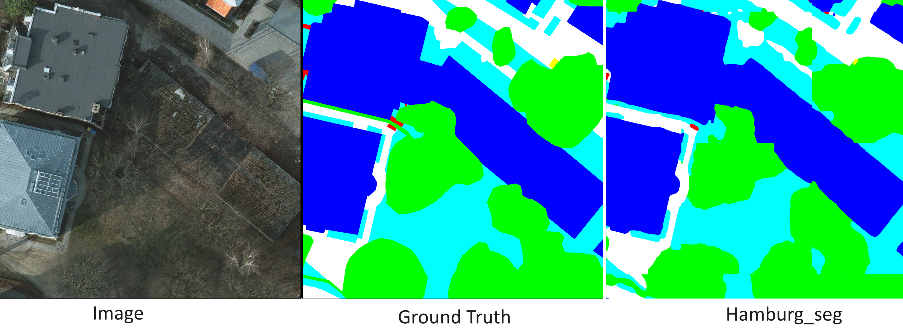

# Data preparation

Since some datasets don't allow to redistribute them, You need to get prepared the zip files. Please check [mmsegmentation/dataset_prepare](https://github.com/open-mmlab/mmsegmentation/blob/main/docs/en/user_guides/2_dataset_prepare.md#prepare-datasets) to get zip files.

After that, please run the following commands to prepare for datasets(Hamburg)

<details open>
<summary><span style="font-size: 1.5em;">Hamburg</span></summary>

Download the original images from [METAVER](https://metaver.de/trefferanzeige?cmd=doShowDocument&docuuid=DD10AFD3-5530-4FD4-933D-5FC71D14B8C7) and GIS data from [METAVER](https://metaver.de/trefferanzeige?cmd=doShowDocument&docuuid=A02FCB1D-8B20-4937-BC9A-235D736B8569).
Put your dataset source file in one directory.

```bash
python tools/convert_datasets/hamburg.py /path/to/hamburg
```
</details>
<br>

# Get Started
i use `python 3.7``mmcv-full=="1.7.1` and `mmsegmentation==0.30.0` and device Nvidia DGX server which has 4 of Tesla V100-DGXS-32GB. Please follow the other dependencies to [mmsegmentation](https://github.com/open-mmlab/mmsegmentation/blob/0.x/docs/en/get_started.md).

<details open>
<summary><span style="font-size: 1.5em;">Environment Setup</span></summary>

__STEP 1.__ Run and install mmsegmentation by the following code. 
> For more information, refer to [mmsegmentaiton/get_started](https://github.com/open-mmlab/mmsegmentation/blob/0.x/docs/en/get_started.md). 

```
pip install -U openmim && mim install mmcv-full=="1.7.1"
pip install mmsegmentation==0.30.0
```

__STEP 2.__ Clone this repository and install.
```base
git clone https://github.com/advaghasiya/hamburg_seg.git
cd hamburg_seg
pip install -v -e .
```
</details>

<details open>
<summary><span style="font-size: 1.5em;">Training</span></summary>

- Single GPU

```bash
python tools/train.py configs/path/to/config
```

For example, to train ham_seg-T on Hamburg dataset:

```bash
python tools/train.py configs/ham_seg/ham_seg_tiny_512x512_hamburg.py
```

- Multi GPUs

```bash
bash tools/dist_train.sh configs/path/to/config num_gpus
```

For example, to train ham_seg-B on hamburg dataset on two gpus:

```bash
bash tools/dist_train.sh configs/ham_seg/ham_seg_base_512x512_hamburg.py 4
```

__Note batch size matters.__ We're using 8 batch sizes.

</details>

<details>
<summary><span style="font-size: 1.5em;">Evaluation</span></summary>

- Single GPU
```bash
python tools/test.py configs/path/to/config work_dirs/path/to/checkpoint --eval metrics
```

For example , to test ham_seg-T on hamburg dataset
```bash
python tools/test.py work_dirs/ham_seg_tiny_512x512_hamburg/date/ham_seg_tiny_512x512_hamburg.py work_dirs/ham_seg_tiny_512x512_hamburg/date/latest.pth --eval mIoU
```

- Multi GPUs
```bash
bash tools/dist_test.py configs/path/to/config work_dirs/path/to/checkpoint num_gpus --eval metrics
```

For example , to test ham_seg-T on hamburg dataset
```bash
bash tools/dist_test.py work_dirs/ham_seg_tiny_512x512_hamburg/date/ham_seg_tiny_512x512_hamburg.py work_dirs/ham_seg_tiny_512x512_hamburg/date/latest.pth 4 --eval mIoU
```

</details>
